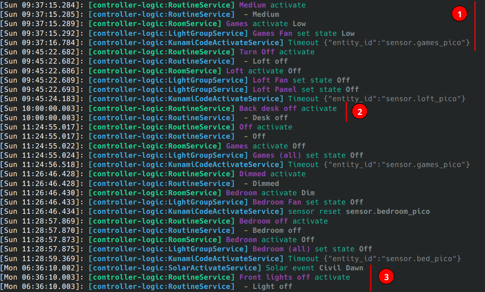
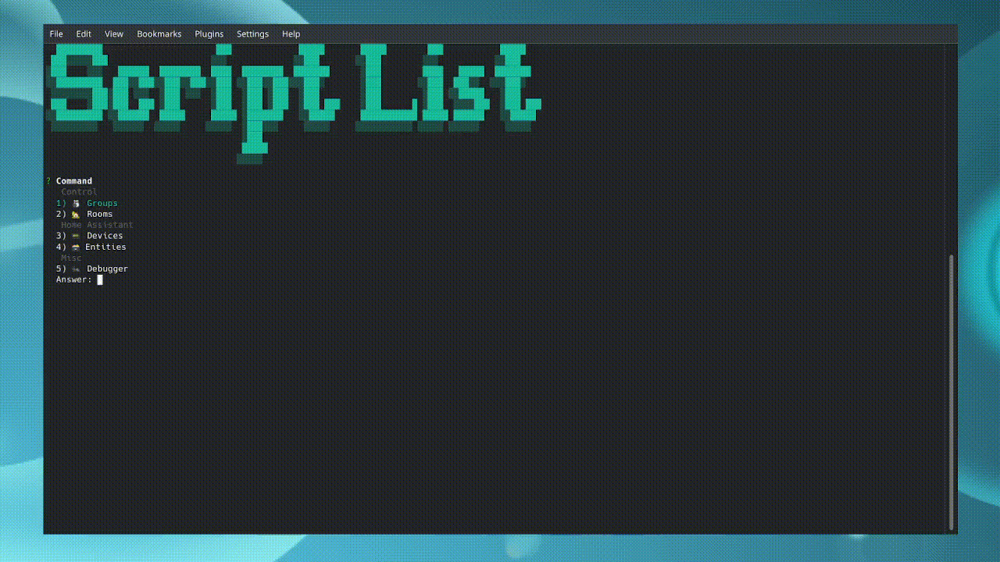

# Automagical tools

## Home Controller

The Home Controller is a NodeJS service that connects to an existing Home Assistant (HA) install through a combination of the websocket and http APIs.
It listens to state changes coming from entities, and is capable of triggering routines in response.
The controller (currently) specializes in lighting and scene control, with some general support for most HA entity domains.

### Example logs

> Logs are from development server, production optimized builds will be less colorful & formatted differently

**Example logs**


1) Event triggered by entity state change
2) Event triggered by cron schedule
3) Event triggered by solar event

### Docker Install

> See wiki for development / bare metal install information

**Example configuration file** *(good presets for docker install)*

```ini
[libs.controller-logic]
  ; MongoDB or compatible URI. No support for sql databases
  MONGO_URI=mongodb://mongo:27017/automagical

[libs.home-assistant]
  ; Base url to your Home Assistant install
  BASE_URL=https://homeassistant.your.domain
  ; Home Assistant Long lived access token
  TOKEN=<HOME ASSISTANT ACCESS TOKEN>

[libs.utilities]
  ; Redis is preferred if available.
  ; Defaults to in-memory caching, which can lose state on reboot
  CACHE_PROVIDER=redis
  REDIS_HOST=redis
  ; debug | info | warn | error | silent
  LOG_LEVEL=debug

[libs.server]
  ; Authentication required by default. Provide a password to protect your stuff
  ADMIN_KEY=super secret password
```

**Example `docker-compose.yaml`** *(recommended basic setup)*

```yaml
---
version: '2'

volumes:
  mongo:

services:
  redis:
    image: redis:latest
    restart: unless-stopped

  mongo:
    image: mongo:latest
    restart: unless-stopped
    volumes:
      - mongo:/data/db

  home-controller:
    image: ghcr.io/ccontour/home-controller:latest
    container_name: home-controller
    volumes:
      # Mount configuration as a file named `config`
      - /path/to/config/file:/home/node/.config/home-controller/config
    restart: unless-stopped
    depends_on:
      - redis
      - mongo
    ports:
      # external_port:internal_port
      - "7000:7000"
```

## Home CLI

Home CLI is the main application interface for the Home Controller.
It is capable of manipulating single entitites, grouping together and working with multiple related entities, and creating routines for automatic changes.
All routines and save states can be run directly through a `POST` command.
These commands can be easily tied into existing Node Red / Home Assistant automations.



### Installation

Home CLI is distributed through NPM

```bash
# via yarn
yarn global add @ccontour/home-cli
# via npm
npm install -g @ccontour/home-cli
```

This will create the `home-cli` command.

### Configuration

**Minimum configuration file**: `~/.config/home-cli`

```ini
[application]
  ; Match to the key provided to the server
  ADMIN_KEY=super secret password
  ; Controller running on a different machine?
  ; CONTROLLER_API=http://10.0.0.1:7000

[libs.utilities]
  LOG_LEVEL=debug
```

### Updating

```bash
# via yarn
yarn global upgrade @ccontour/home-cli --latest
# via npm
# TODO: fill in
```

### Removing

```bash
# via yarn
yarn global remove @ccontour/home-cli
# via npm
npm remove -g @ccontour/home-cli
```

This will **NOT** remove your configuration file.
