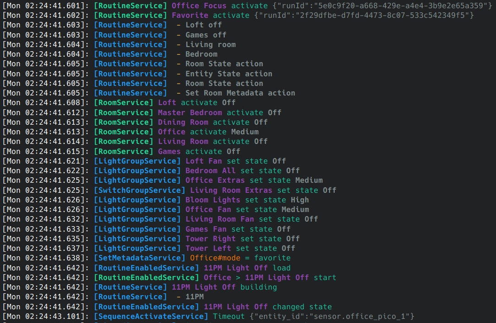
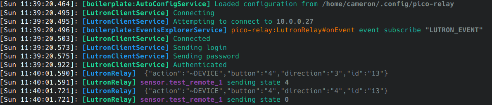
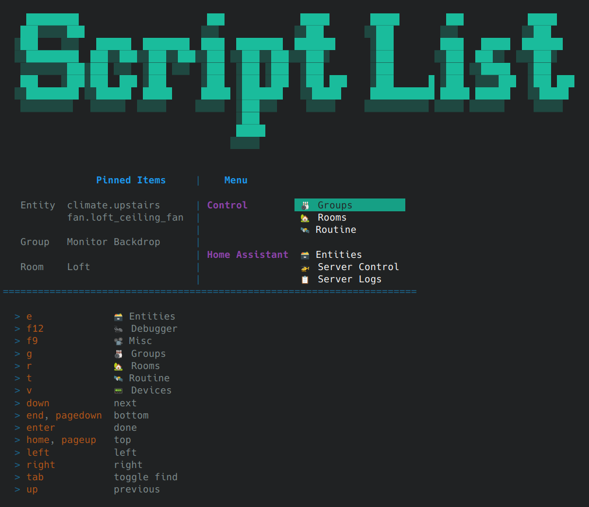

# 🦕 [@steggy](https://github.com/ccontour/steggy) monorepo

- [Changelog](https://github.com/ccontour/steggy/wiki/Changelog)

## [Home Configure](apps/home-configure)

React based web interface for setting up the the [Home Controller](apps/home-controller).

## [Home Controller](apps/home-controller)

NestJS based application that connects to Home Assistant through the websocket api, and providing the logic and web api.

## [node-red-contrib-steggy](libs/node-red-contrib-steggy)

## [pico-relay](apps/pico-relay)

Lightweight docker container that connects to a Lutron hub, creates / maintains entities in Home Assistant to match.

## [Home CLI](apps/home-cli)

Terminal application for manipulating entities, groups, and rooms through the [Home Controller](apps/home-controller).

