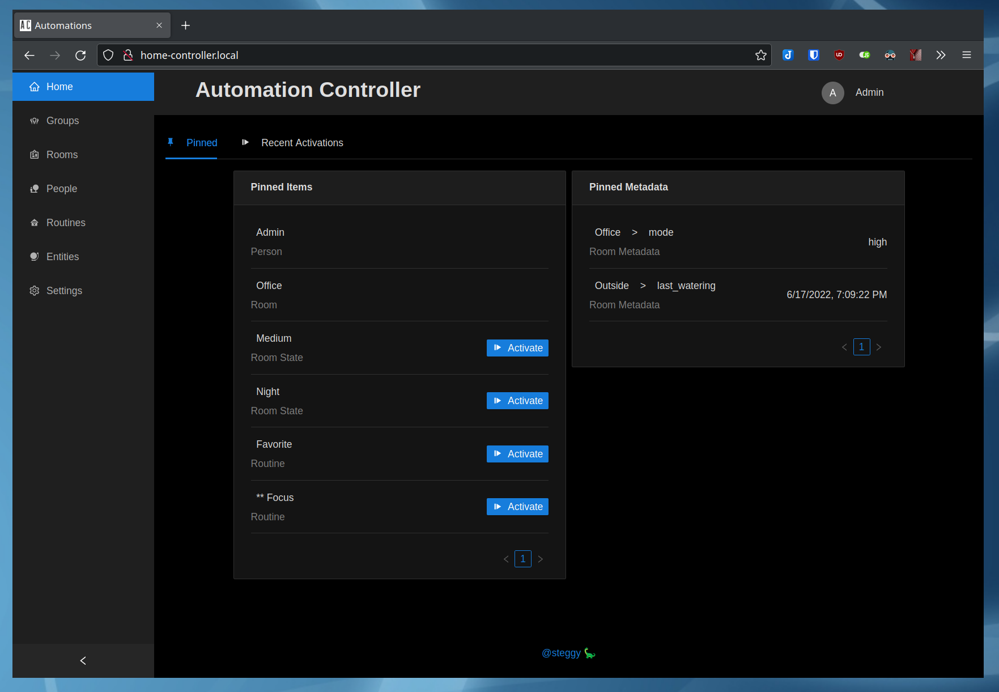

# @automagical monorepo

## [Home Configure](apps/home-configure)

React based web interface for setting up the the [Home Controller](apps/home-controller).

## [Home Controller](apps/home-controller)

NestJS based application that connects to Home Assistant through the websocket api, and providing the logic and web api.

## [Home CLI](apps/home-cli)

Terminal application for manipulating entities, groups, and rooms through the [Home Controller](apps/home-controller).
