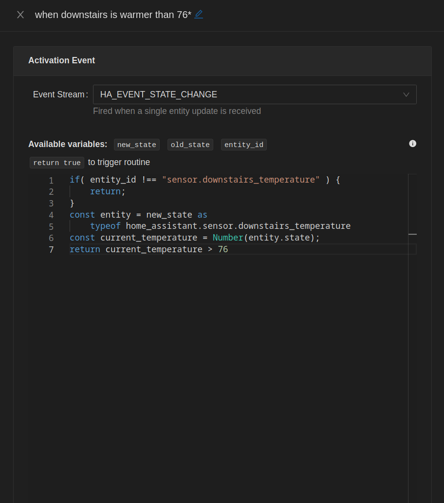

# 🦕 [@steggy](https://github.com/mp3three/steggy) monorepo

## Applications

### [Home Controller](apps/home-controller) (backend) + [Home Configure](apps/home-configure) (frontend)

Standalone automation driver with integrations for Home Assistant, Node Red, and more.

| Main UI | Code |
| --- | --- |
|  |  |

### [Node Red Contrib](libs/node-red-contrib-steggy)

<!-- 🙊 shh, it's an app in disguise. 🙊 -->

Node Red integration for [Home Controller](apps/home-controller).

### [Home CLI](apps/home-cli)

Standalone terminal app to issue commands against [Home Controller](apps/home-controller)

### [Config Builder](apps/config-builder)

A script to manage file based configurations for applications based off `@steggy/boilerplate`.

### [Log Formatter](apps/log-formatter)

Pipe JSON logs in via stdin, get pretty/readable logs out.
Fills same idea as [pino-pretty](https://www.npmjs.com/package/pino-pretty), but using the `SyncLogger` formatter from this repo.

### [Build Pipeline](apps/build-pipeline)

> (internal tool)

The code used to create and publish builds when code changes.
Not publicly published, but available as the `yarn pipeline` command.

### [Pico Relay](apps/pico-relay)

Microservice to watch a Lutron Hub for events coming from Pico remotes.
Events are relayed to Home Assistant as sensor updates.
Used together with logic inside [Home Controller](apps/home-controller) to drive logic.

## Libraries

### [Boilerplate](libs/boilerplate)

NestJS application bootstrapping functions and general purpose tools.

### [Controller SDK](libs/controller-sdk)

Basic functionality for use in [Home Controller](apps/home-controller).
Separated out for future development.

### [Controller Shared](libs/controller-shared)

Shared type definitions for everything working together on [Home Controller](apps/home-controller)

### [Home Assistant](libs/home-assistant)

Home Assistant websocket and traffic management, http api wrapper, and general coordinator

### [Home Assistant Shared](libs/home-assistant-shared)

Shared type definitions related to the [Home Assistant](libs/home-assistant) library

### [Persistence](libs/persistence)

General purpose mongodb persistence tools.
Quickly form connections, and create complex queries

### [Server](libs/server)

Enables web server functionality for [@steggy/boilerplate](libs/boilerplate).
Provides generic middleware tools like `cors` and automatic request logging

### [TTY](libs/tty)

> friends with [chalk](https://www.npmjs.com/package/chalk) for formatting

Utilities for creating terminal applications.

- Menus
- Prompts
- Keyboard management
- Screen management
- Cursor management

### [Utilities](libs/utilities)

General purpose utilities and constants for `@steggy`
