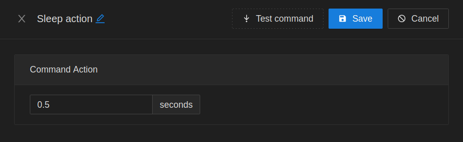

# Home Controller

## Recommended Configuration

### Docker Compose

A MongoDB compatible database is required. Redis is recommended, but optional

```yaml
---
version: "2.1"

volumes:
  mongo:

services:
  home-controller:
    image: containers.programmable.work/home-controller:latest
    container_name: home-controller
    volumes:
      - /path/to/config_file:/.home-controllerrc
    restart: unless-stopped
    depends_on:
      - redis
      - mongo
    links:
      - redis
      - mongo
    ports:
      - "7000:7000"

  redis:
    container_name: home-controller_redis
    image: redis
    restart: unless-stopped

  mongo:
    container_name: home-controller_mongo
    image: mongo
    restart: unless-stopped
    volumes:
      - mongo:/data/db

```

### Example Config

Admin key used to authenticate http requests.

```ini
[libs.boilerplate]
  CACHE_PROVIDER=redis
  REDIS_HOST=redis
  LOG_LEVEL=debug

[libs.controller-logic]
  MONGO_URI=mongodb://mongo:27017/home-controller

[libs.home-assistant]
  BASE_URL=https://homeassistant.your.domain
  ; Long-Lived Access Token
  TOKEN=

[libs.server]
  ADMIN_KEY=super secret password
```

## Grouping

Note: This project is **NOT** inteded to be a dashboard. There is no persistent connection open from the UI to the backend, nor to Home Assistant. The UI may not always match actual entity state.

### Groups

Groups take a collection of entitites, and provides tools to allow them to act in a coordinated fashion. All group types have the ability to create save states, which contain state / attribute information to set. Some groups, such as *light groups* also expose specialized actions such as dimming.

Entities may be shared in multiple groups.

| Type | Group Detail | Save State |
| --- | --- | --- |
| Light | [](docs/light.group.png) | [](docs/light.group.save_state.png) |
| Switch | [](docs/light.group.png) | [](docs/light.group.save_state.png) |
| Switch | [](docs/light.group.png) | [](docs/light.group.save_state.png) |
| Switch | [](docs/light.group.png) | [](docs/light.group.save_state.png) |

### Rooms

Rooms are collections of groups and entities.

| Detail | Save State |
| --- | --- |
| [](docs/light.group.png) | [](docs/light.group.save_state.png) |

## Routines

### Activation Event: Sequence

The sequence activation is used for testing a series of state changes inside of a time period. In this example, a [Lutron Pico](https://www.amazon.com/dp/B00KLAXFQ0) remote is set up to look for center => dim up to be pressed.

[](docs/sequence.activate.png)

Each change in state must happen within 1500ms of the previous change. If a series of changes occurs, without ever crossing that rolling time limit, then the activation event will fire.

Multiple activation events can look for different sequences on the same entity. The internal tracker of the current state sequence (clears out on 1500ms expiration) can be manipulated via the reset option.

- Self Reset: Reset the tracker used by this activation event only
- Sensor Reset: Reset the tracker for ALL activation events attached to entity

### Activation Event: Cron

Cron activate can take in either a standard cron schedule, or have a preformatted expression chosen from a list.

[](docs/cron.activate.png)

### Activation Event: Solar

Solar activation events are based off the sun's location in the sky. Math is performed using lat/long reported by Home Assistant, and current date/time.

[](docs/solar.activate.png)

### Activation Event: State Change

State change activation events are for more complex tests performed against an entity state.

[](docs/state-change.activate.png)

The latch option is used for preventing excess activations when repeat state changes. Once the activation event fires, it will not fire again until the provided condition evaluates to false.

The debounce option is used to throttle repeated activations from a match. This can be used for filtering out noise from contact switches, for example.

### Command Action: Entity State

Manipulate entity state / attributes.

[](docs/command.entity_state.png)

### Command Action: Group State

Trigger a previously saved group state

[](docs/command.group_state.png)

### Command Action: Group Action

Run a custom group action.

[](docs/command.light_group_action.png)

### Command Action: Room State

Trigger a previously saved room state

[](docs/command.room_state.png)

### Command Action: Send Notification

Send a notification through Home Assistant. Will be delivered through Home Assistant phone app

[](docs/command.notification.png)

### Command Action: Sleep

Insert a pause between commands. Only applies to routines operating in sync mode.

[](docs/command.sleep.png)

### Command Action: Trigger Routine

Trigger another routine

[](docs/command.routine.png)

### Command Action: Webhook

Emit a http request to a target

[](docs/command.routine.png)

### Command Action: Stop Processing

> Only applies to routines in sync mode.

Stop command execution if condition triggers. Used for flow control

[](docs/command.routine.png)

| Description | Image |
| --- | --- |
| Attribute Test | [](docs/stop_processing.attribute.png) |
| State Test | [](docs/stop_processing.state.png) |
| Template | [](docs/stop_processing.template.png) |
| Webhook Test | [](docs/stop_processing.webhook.png) |
| Relative Date Test | [](docs/stop_processing.relative_date.png) |
