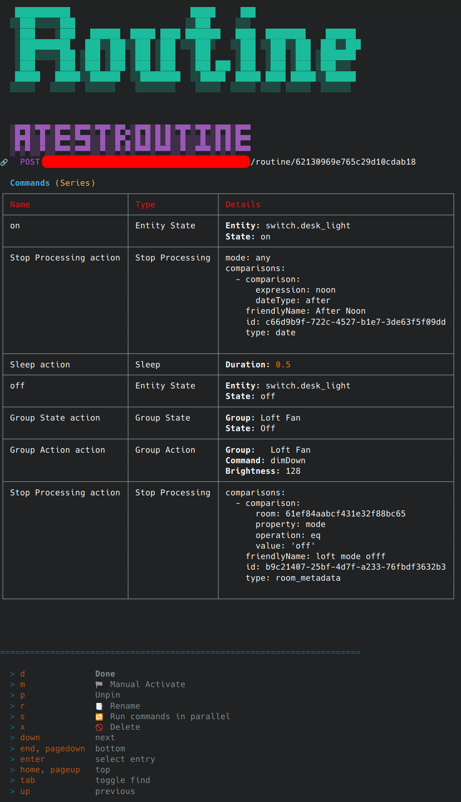

# Home CLI

## Description

The Home CLI is a tool for issuing commands to the Controller using the rest api. It is installed indpendently from the controller, using npm.
This app doesn't run any background logic, a

## Install

To install the `home-cli` bash command.

### Yarn

```bash
# install
yarn global add @automagical/home-cli --registry=https://npm.programmable.work
# update
yarn global upgrade @automagical/home-cli
```

### NPM

```bash
npm install -g @automagical/home-cli --registry=https://npm.programmable.work
```

## Configuration

Pinned items are added to configuration file

### Recommended basic setup

> Using Redis as the cache provider allows for elements such as initial menu position to be temporarily persisted
>
> Completely optional feature

```ini
[application]
  CONTROLLER_API=http://localhost:7000

  ADMIN_KEY=super secret password

[libs.boilerplate]
  CACHE_PROVIDER=redis
```

### All Options

```ini
[application]

  ; HTTP API target for the home controller
  CONTROLLER_API=http://localhost:7000

  ; Admin key for the home controller
  ADMIN_KEY=

  ; Magic sleep timer for headers
  REFRESH_SLEEP=100

  ; Max width for ascii charts
  MAX_GRAPH_WIDTH=150

  ; Default title for app
  APP_TITLE=Home CLI

[libs.boilerplate]
  ; default = info
  LOG_LEVEL=info | warn | debug

  ; default = memory
  CACHE_PROVIDER=redis | memory

  ; only used with redis cache provider
  REDIS_HOST=localhost

  REDIS_PORT=6379

  REDIS_DEFAULT_TTL=86400

[libs.tty]
  ; Automatically managed by application
  PINNED_ITEMS=

  ; Maxmimum number of items displayed in pickMany prompts
  PAGE_SIZE=20

  ; Color for primary header text + dividing line. Color must make sense to chalk
  HEADER_COLOR=bgBlue.black

  ; Figlet font
  DEFAULT_HEADER_FONT=DOS Rebel

  ; Figlet font
  SECONDARY_HEADER_FONT=Pagga
```

## Application

| Description | Image |
| --- | --- |
| Climate Entity | [](docs/images/climate.entity.png) |
| Group List | [](docs/images/group.list.png) |
| Light Group | [](docs/images/light.group.png) |
| Room | [](docs/images/room.png) |
| Room States | [](docs/images/room.states.png) |
| Routine | [](docs/images/routine.png) |
| Server Control | [](docs/images/server-control.png) |
