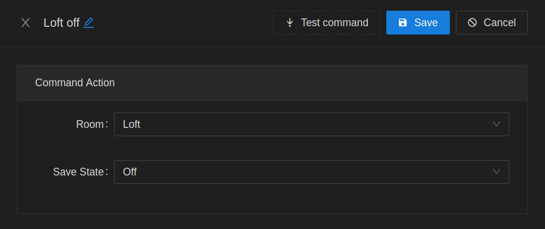

# Routine Commands

## Entity State

Manipulate entity state / attributes.

## Group State

Trigger a previously saved group state

## Group Action

Run a custom group action.

## Room State

Trigger a previously saved room state

## Send Notification

Send a notification through Home Assistant. Will be delivered through Home Assistant phone app

## Set Room Metadata

Update the value of a room metadata property

## Trigger Routine

Trigger another routine

## Webhook

Emit a http request to a target

## Sleep

> Only applies to routines in sync mode.

Insert a pause between commands. Only applies to routines operating in sync mode.

## Stop Processing

> Only applies to routines in sync mode.

Stop command execution if condition triggers. Used for flow control

| Description | Image |
| --- | --- |
| Attribute Test |  |
| State Test |  |
| Template |  |
| Webhook Test |  |
| Room Metadata Test |  |
| Relative Date Test |  |
