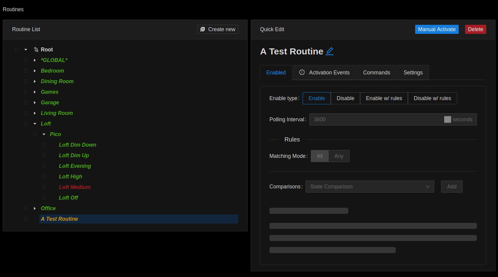

# Routines

## Detail Page

### List

Items are colored based on their current mount state on the controller.

- Green = enabled
- Red = disabled
- Yellow = enabled, but not mounted
  - No activation events or commands

### Grouping

Routines can be placed into groups, for both sanity and workflow purposes.
If a routine with descendant routines is disabled, then all the descendants will also be disabled.
