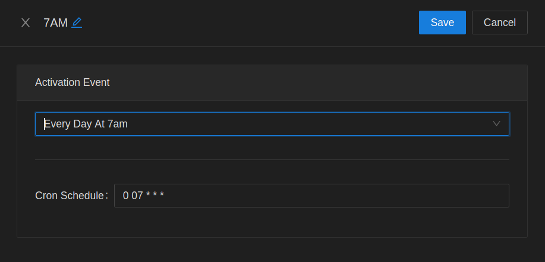
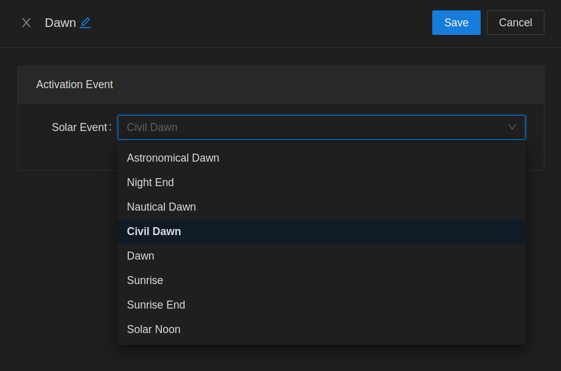
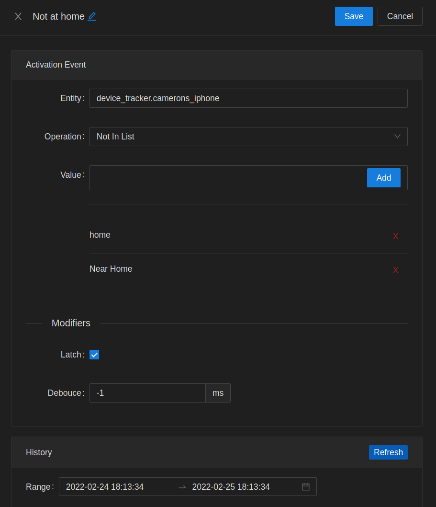

# Activation events

## Sequence

The sequence activation is used for testing a series of state changes inside of a time period. In this example, a [Lutron Pico](https://www.amazon.com/dp/B00KLAXFQ0) remote is set up to look for center => dim up to be pressed.

Each change in state must happen within 1500ms of the previous change. If a series of changes occurs, without ever crossing that rolling time limit, then the activation event will fire.

Multiple activation events can look for different sequences on the same entity. The internal tracker of the current state sequence (clears out on 1500ms expiration) can be manipulated via the reset option.

- Self Reset: Reset the tracker used by this activation event only
- Sensor Reset: Reset the tracker for ALL activation events attached to entity

## Cron

Cron activate can take in either a standard cron schedule, or have a preformatted expression chosen from a list.

## Solar

Solar activation events are based off the sun's location in the sky. Math is performed using lat/long reported by Home Assistant, and current date/time.

## State Change

State change activation events are for more complex tests performed against an entity state.

The latch option is used for preventing excess activations when repeat state changes. Once the activation event fires, it will not fire again until the provided condition evaluates to false.

The debounce option is used to throttle repeated activations from a match. This can be used for filtering out noise from contact switches, for example.
