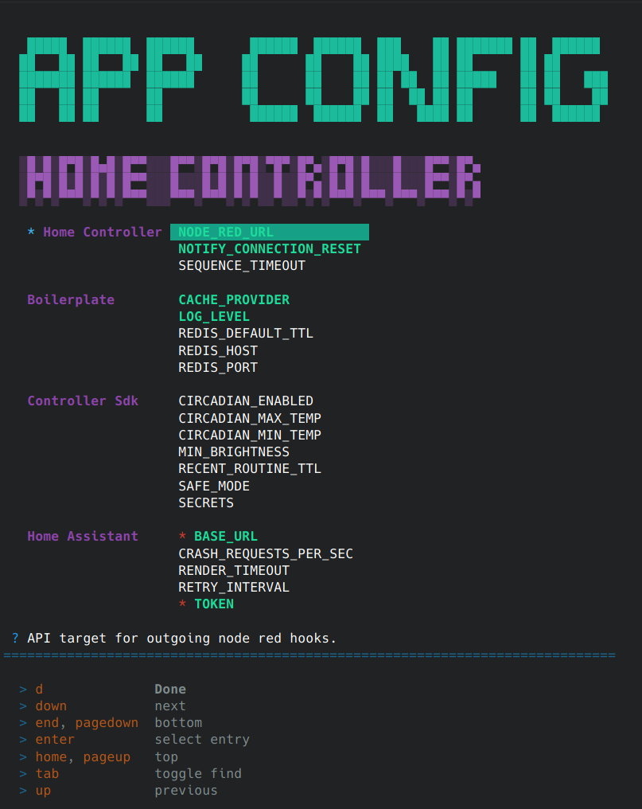

# Applications

> This page documents the primary applications shipped by this repo.
> There are additional side projects to be found in the `apps` folder

## Docker Containers

### Home Controller: [backend](../apps/home-controller) + [frontend](../apps/home-configure)

The Controller is an application that integrates with Home Assistant, through the websocket api, for the purpose of driving automation logic.
Simple automations can be built up through a builder UI.
More advanced automation logic can be provided via code editors embedded in the application, which provide full typescript language features.

|  |  |
| --- | --- |
| Main Page | Example Editor |
|  |  |

## Terminal Applications

### [Home CLI](../apps/home-cli)

Standalone terminal app to issue commands against [Home Controller](../apps/home-controller).
Cannot be used to configure functionality.

---

### [Config Builder](../apps/config-builder)

Terminal app capable of configuring applications built off of `@steggy/boilerplate`.
It reads all the configuration items that an application can consume, and presents an interface for inputing values.
When complete, it is capable of writing to a common configuration file shared with the application being configured.

---

### [Controller Backup](../apps/controller-backup)

Database backup tool for Home Controller.
Create and restore collections, transfer between servers, etc.

---

## Other

### [Node Red Contrib Steggy](../libs/node-red-contrib-steggy)

<!-- 🙊 shh, it's an app in disguise. 🙊 -->

Node Red integration for [Home Controller](../apps/home-controller).

